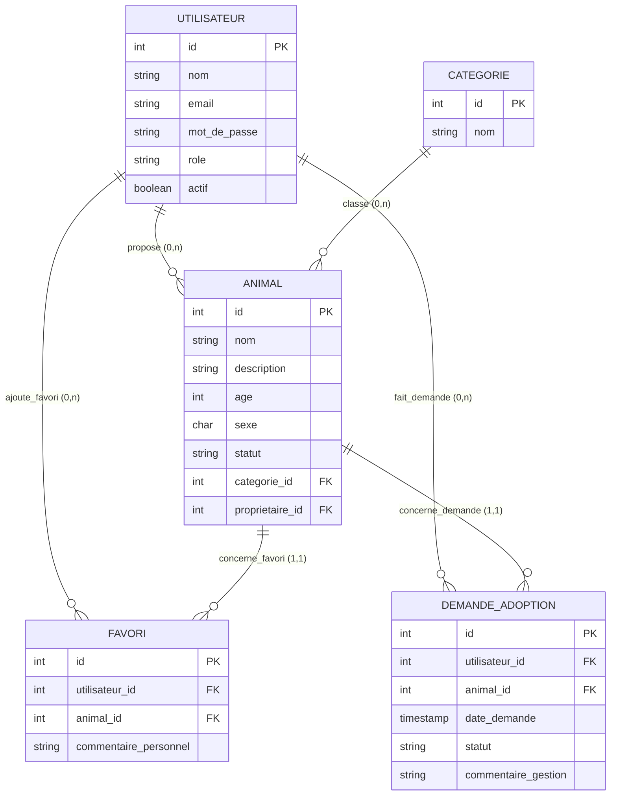

# 📐 Modèle Conceptuel des Données (Merise)

## Entités et Attributs
* **UTILISATEUR** (id, nom, email, mot_de_passe, role, actif)
* **CATEGORIE** (id, nom)
* **ANIMAL** (id, nom, description, age, sexe, statut)

## Associations et Cardinalités
* **proposer** : UTILISATEUR (0,n) <---> (1,1) ANIMAL
* **classer** : CATEGORIE (0,n) <---> (1,1) ANIMAL
* **favoris** (porte : *commentaire_personnel*) : UTILISATEUR (0,n) <---> (0,n) ANIMAL
* **demande_adoption** (porte : *statut, commentaire_gestion*) : UTILISATEUR (0,n) <---> (0,n) ANIMAL

---

# 📊 Diagramme Entité-Association (MCD)

---

# 💾 Modèle Logique des Données (MLD)

* **utilisateurs** (id [PK], nom, email [UNIQUE], mot_de_passe, role, actif)
* **categories** (id [PK], nom)
* **animaux** (id [PK], nom, #categorie_id [FK], description, age, sexe, statut, #proprietaire_id [FK])
* **favoris** (id [PK], #utilisateur_id [FK], #animal_id [FK], commentaire_personnel)
* **demandes_adoption** (id [PK], #utilisateur_id [FK], #animal_id [FK], date_demande, statut, commentaire_gestion)
